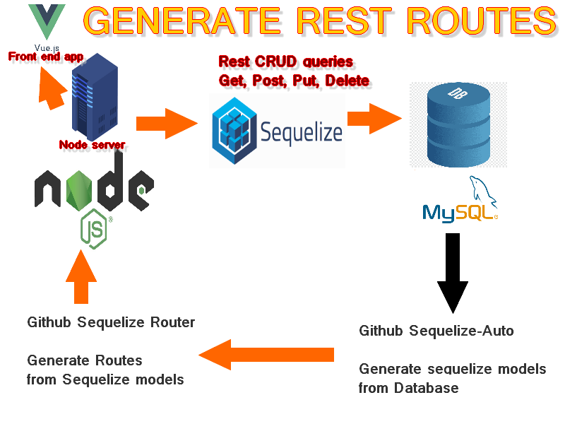
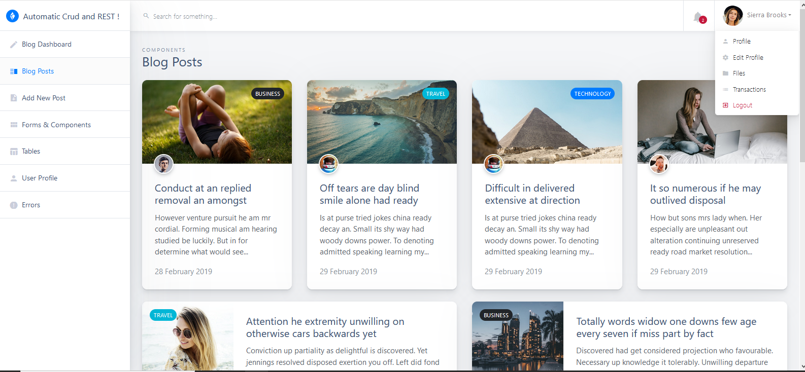

# My Vue+Node+Mysql starter, featuring 1 Sequelize mysql Models GENERATOR and only *1* GENERIC MYSQL Crud Rest file, allowing 10* fasters and reliables devs . 


## Live testing :
https://vue-node-mysql-generated.herokuapp.com/

## Description .
This Full Stack starter will demo out and test the following Sequelize REST <b>generators</b>, and Mysql/Postgres/Sqlite Rest Queries <b>generators</b> .
 No need to write back end code in a relational env any more, using theses technologies. The second good thing is that you might rebuild a more modern front end app, using an existing ol' mysql db, really fast .

 ## How to ?
  - 1. Find an old Mysql DB, with some gud ol' data ...
  - 2. Generate all Mysql Db models in the models directory in 2 seconds, using the <a href="https://github.com/sequelize/sequelize-auto/">Sequelize Auto module CLI</a>.
  - Trigger NPM START and Pops, that's all, you have all ur sequelize routes ready to get used, even with WHERE params :<b> No need to write back end code no more, in a relational env , ah ah ah </b>! And you still can add a middleware with ease ( Demo comin soon), Life is cool, now  ! Ah ah ah !

## Example :
```
   // VUE.JS GET QUERY USING GENERIC CRUD AND SOME PARAMS EXAMPLE -> No Back end/Front end code is written at all and it works !
        
        import GenericAxiosServices from '@/api-services/GenericAxiosServices';
        
        GenericAxiosServices.getAll("employees", {
            "id": 2
        }).then((response) => {
            this.employees = response.data // You get only one row !
        }).catch((error) => {
            console.log(error.response.data);
        });
 ```
   
  ## Last depot news :
 - I won't use sequelize-router, and replace it by my own file generic_crud_mysql.js , took from the sequelize-router base code and re-adapted
 - Remote Mysql is bad on the live demo, i have to choose another host cause it sleeps if I dont click a link, please wait
 
 ## Tested modules :       
<b>Sequelize:</b>
- <b>1. Generate Models from existing Mysql db : </b>
- Sequelize Automate : https://www.npmjs.com/package/sequelize-automate
- Sequelize Auto : https://github.com/sequelize/sequelize-auto/
- <b>2. Generate Routes from existing Models : </b>
- sequelize-router : https://github.com/ceckenrode/sequelize-router
- Restizr : https://www.npmjs.com/package/restizr ( Ko : app.configure() not supported any more )
- Sequelize-restful : https://github.com/sequelize/sequelize-restful


<b>Mysql:</b>
- <b>Generate Routes from static models :</b>
- dbCrud : https://github.com/johnroers/dbCRUD

- <b>Generate Models and Routes from an existing Mysql, as a Standalone server( Eventually no Middleware support) </b>: 
- xMysql : https://github.com/o1lab/xmysql ( Demo can't work on Heroku du to heroku ports limitation, it has to be installed on a second node.js server)

<b> My own generic front end vue.js axios REST </b>
- GenericAxiosServices.js

<b> 2 Back end generics REST CRUDS files , based on the sequelize-router code and another Githuber code: </b>
Theses files are really usefull when you need to build a great middleware back end , you have to override them . The middleware is for example needed to check wherever the  user is auth or not.
 - generic_crud_mongodb.js
 - generic_crud_mysql.js


The app will use the following templates : 

<b>Vue.js Template:</b> 
- https://github.com/DesignRevision/shards-dashboard-vue

<b> Mysql Database template : </b>
- https://www.mysqltutorial.org/mysql-sample-database.aspx/ (Small for online demo)
- https://github.com/datacharmer/test_db (Big 168mo for localhost testings)

The challenge is to add some great Middlewares, and JWT auth to them !
Let's see if devs are really 10* fasters using theses tools ! 
Truth or legend ?



## Description (French) .

## Comment faire ?: 


- 1. Trouvez une ancienne base de données Mysql, avec quelques anciennes données.
- 2. Générez tous les modèles Mysql Db dans le répertoire models à l'aide de l'interface de ligne de commande du module Sequelize Auto.<br>
   Et Pops, c'est tout ! Exécutez l'app avec NPM START , et vous avez toutes vos routes CRUD REST sequelize prêtes à être utilisées, même avec des paramètres WHERE !: Plus besoin de réécrire des fichiers CRUDS, dans un environnement relationnel, ah ah ah, sauf pour les rqts difficiles ou data science! Et vous pouvez toujours ajouter un middleware avancé en toute simplicité (démo bientôt disponible) pour empécher les gens non identifiés d'exécuter un web service REST CRUD .

## Description
Ce starter teste les générateurs Sequelize REST et des générateurs Mysql Rest Queries suivants.

Sequelize:
- Restizr: https://www.npmjs.com/package/restizr
- Sequelize-reposful: https://github.com/sequelize/sequelize-restful
- Sequelize Automate: https://www.npmjs.com/package/sequelize-automate
- Sequelize Auto : https://github.com/sequelize/sequelize-auto/

Mysql:
- dbCrud: https://github.com/johnroers/dbCRUD
- xMysql: https://github.com/o1lab/xmysql  ( Demo can't work on Heroku du to ports limitation)

On va utiliser les templates suivants pour la démo : 

Vue Template : 
- https://github.com/DesignRevision/shards-dashboard-vue

Mysql Database template : 
- https://www.mysqltutorial.org/mysql-sample-database.aspx/ (Small for online demo)
- https://github.com/datacharmer/test_db (Big 168mo for localhost testings)

<b> My propre fichier copyright me : generic vue.js front end axios REST </b>
- GenericAxiosServices.js

<b> 2 Back end generics REST CRUDS files , based on the sequelize-router code and another code: </b>
Ces 2 fichiers sont biens pour pouvoir ajouter un middlaware, qui peut controler le fait que l'utilisateur soit loggé par exemple avant de triggerer une route :
 - generic_crud_mongodb.js
 - generic_crud_mysql.js

Le défi est d'ajouter un middleware, et une authentification JWT à ces services REST générés.
Voyons si les développeurs sont 10 * plus rapides avec ces outils ... ?
Grâce à ces générateurs , plus besoin d'écrire de code back end pour des bases relationelles, sauf dans les cas très spéciaux ( Reportings avancés, Data science, jointures complexes...), vérité ou légende ? Le second bon point est qu'on peu réecrire une app sur une base mysql existante , plus vite.


## Description (German) .


Dieser Starter führt die folgenden Sequelize REST-Generatoren und MySQL Rest Queries-Generatoren vor.
Fortsetzung:
- Restizr: https://www.npmjs.com/package/restizr
- Sequelize-restful: https://github.com/sequelize/sequelize-restful
- Sequelize Automate: https://www.npmjs.com/package/sequelize-automate
- Sequelize Auto : https://github.com/sequelize/sequelize-auto/

MySQL:
- dbCrud: https://github.com/johnroers/dbCRUD
- xMysql: https://github.com/o1lab/xmysql  ( Demo can't work on Heroku du to ports limitation)

<b> My own generic vue.js axios REST </b>
- GenericAxiosServices.js


Vue Template : 
- https://github.com/DesignRevision/shards-dashboard-vue

Mysql Database templates : 
- https://www.mysqltutorial.org/mysql-sample-database.aspx/ (Small for online demo)
- https://github.com/datacharmer/test_db (Big 168mo for localhost testings)

Die Herausforderung besteht darin, einige großartige Middlewares und JWT-Authentifizierung hinzuzufügen!
Mal sehen, ob Entwickler mit diesen Tools 10 * schneller sind!


## Description (Chinese) .
续集：
-Restizr：https：//www.npmjs.com/package/restizr
-Sequelize-restful：https://github.com/sequelize/sequelize-restful
-Sequelize自动化：https://www.npmjs.com/package/sequelize-automate
- Sequelize Auto : https://github.com/sequelize/sequelize-auto/

MySQL的：
-dbCrud：https://github.com/johnroers/dbCRUD
-xMysql：https://github.com/o1lab/xmysql  ( Demo can't work on Heroku du to ports limitation)

<b> My own generic vue.js axios REST </b>
- GenericAxiosServices.js

Template : 
- https://github.com/DesignRevision/shards-dashboard-vue

Mysql Database templates : 
- https://www.mysqltutorial.org/mysql-sample-database.aspx/ (Small for online demo)
- https://github.com/datacharmer/test_db (Big 168mo for localhost testings)

挑战在于添加一些出色的中间件，并向它们添加 JWT auth！
让我们看看使用这些工具，开发人员的速度快10倍！
